# ArUco Shapes

> considering **Green for white color, and Red for black**.
>
> The three available sizes are: `x1`, `x2`, `x3`
---

## ID 18

---

| Level | White | Black |
| :------------- | :-------------:| :-----:|
| **Easy**   | 9 `x1` | 7 `x1` |
| **Medium** | 3 `x1` + 3 `x2` | 3 `x1` + 2`x2` |
| **Hard**   | 3 `x1` + 2 `x3` | 3 `x1` + 3 `x2` |

### Easy

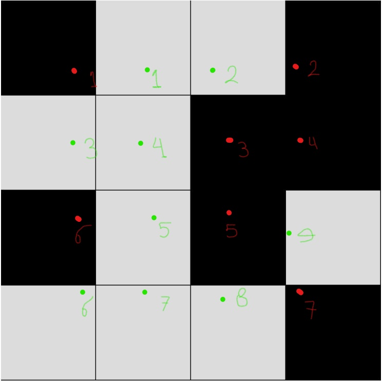
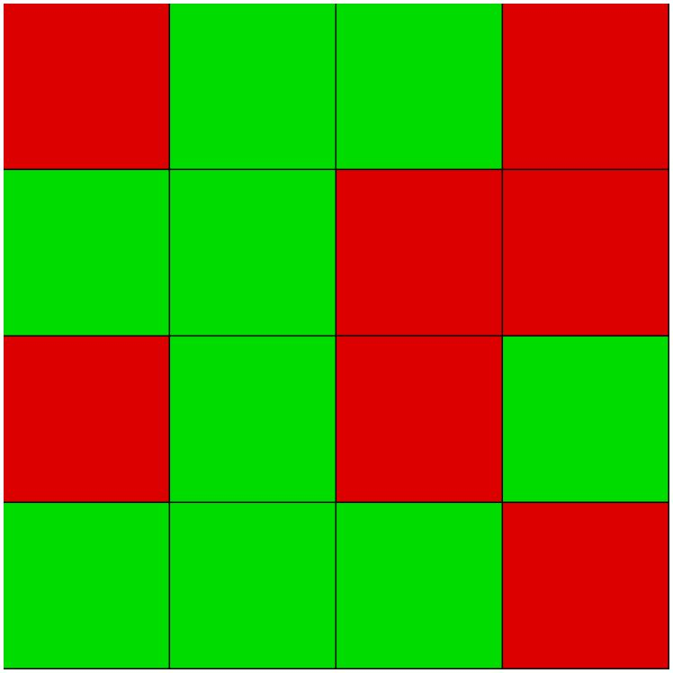

### Medium

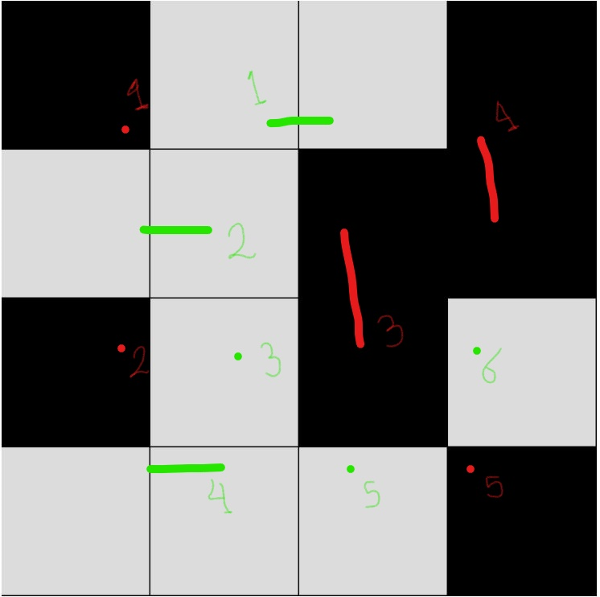
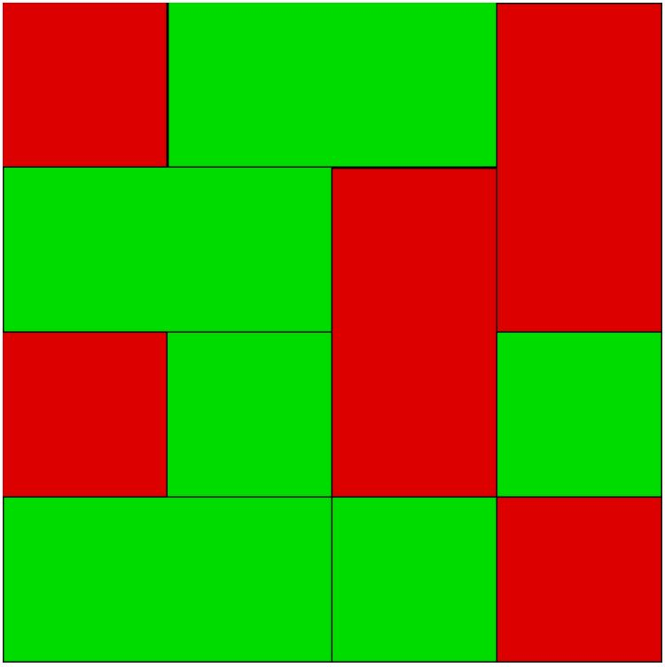

### Hard

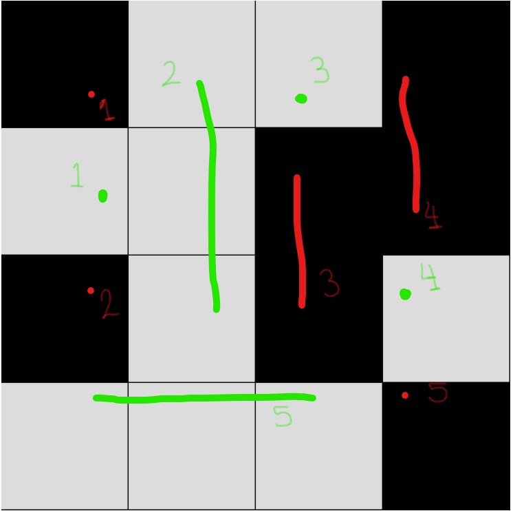
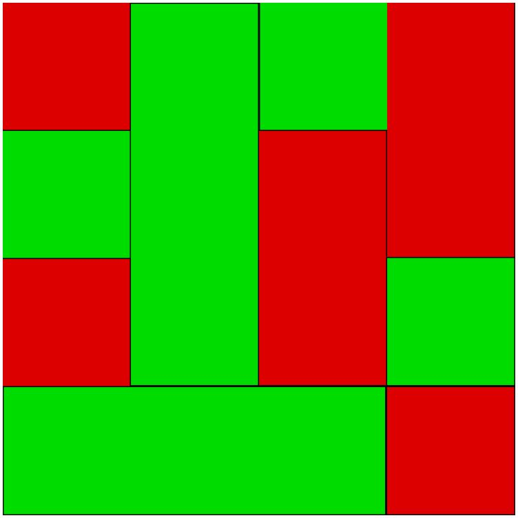

---

## ID 25

---

| Level | White | Black |
| :------------- | :-------------:| :-----:|
| **Easy**   | 7 `x1` | 9 `x1` |
| **Medium** | 3 `x1` + 2 `x2` | 1 `x1` + 4`x2` |
| **Hard**   | 4 `x1` + 1 `x3` | 2 `x3` + 1 `x3` |

### Easy

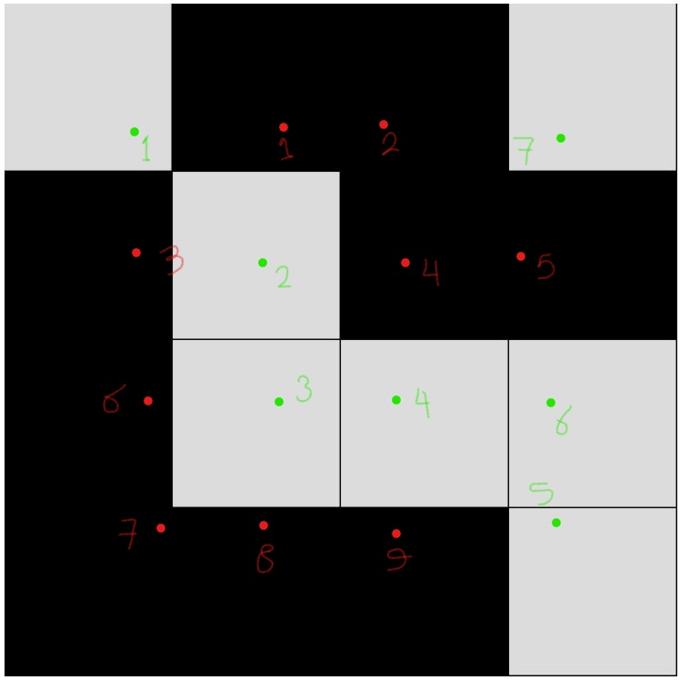
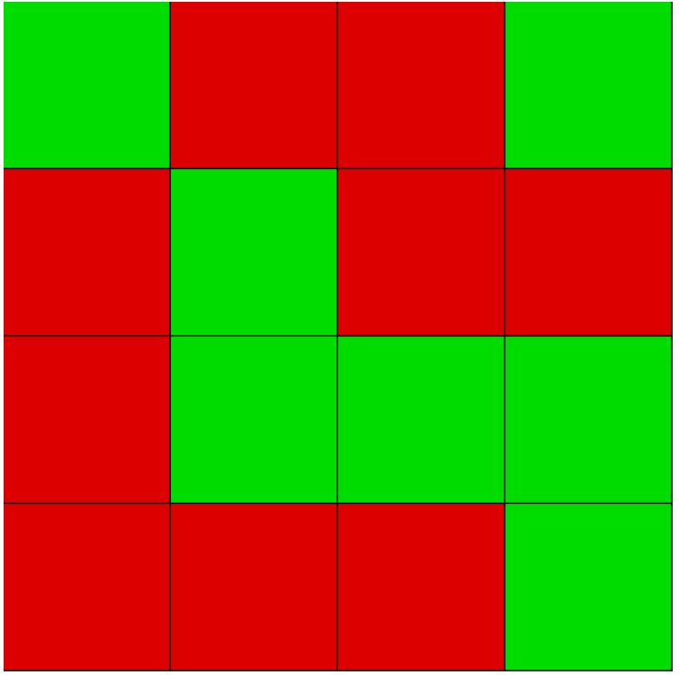

### Medium

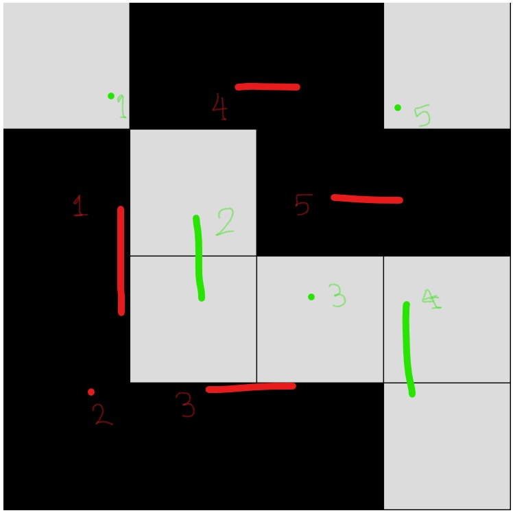

### Hard

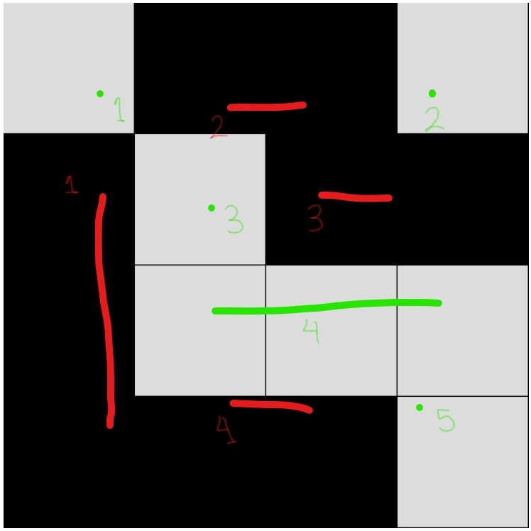
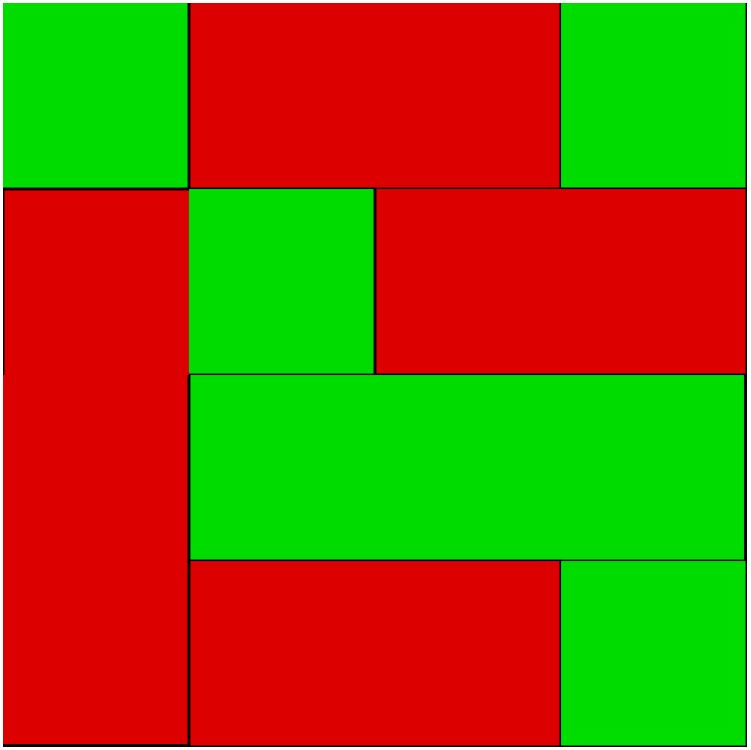

---

## ID 101

---

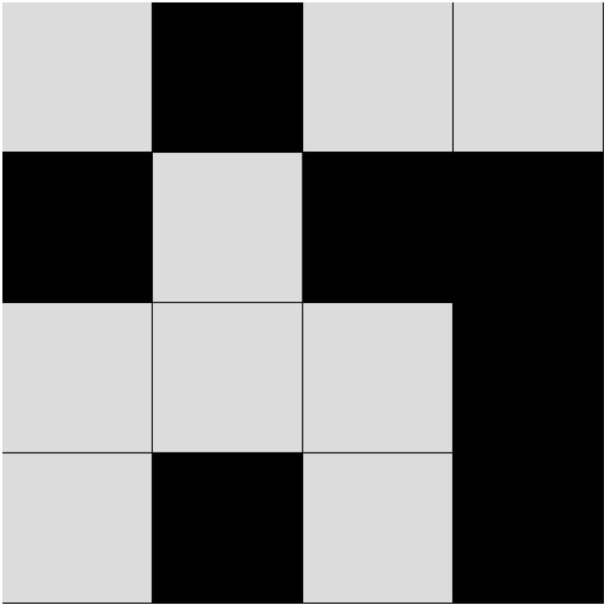

| Level | White | Black |
| :------------- | :-------------:| :-----:|
| **Easy**   | 9 `x1` | 7 `x1` |
| **Medium** | 1 `x1` + 4 `x2` | 3 `x1` + 2`x2` |
| **Hard**   | 4 `x1` + 1 `x2` + 1 `x3` | 4 `x1` + 1 `x3` |

### Easy

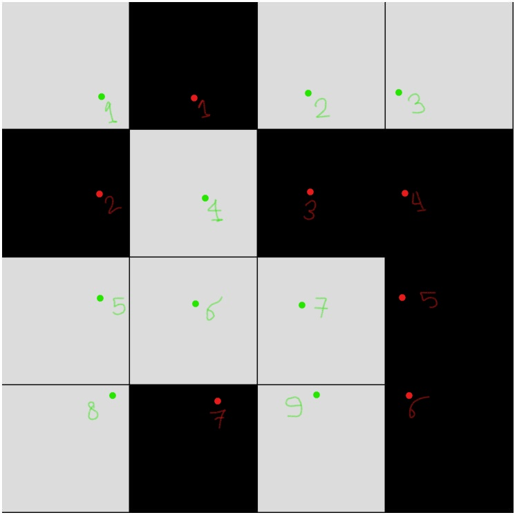
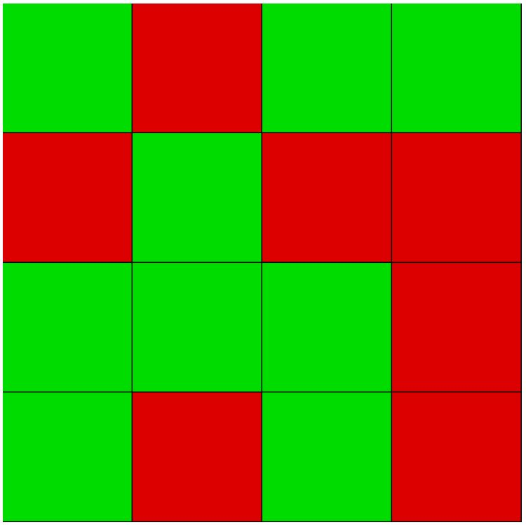

### Medium

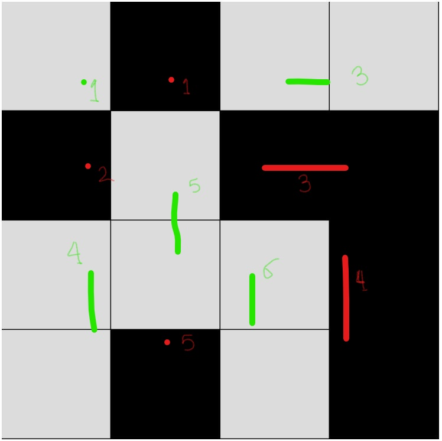
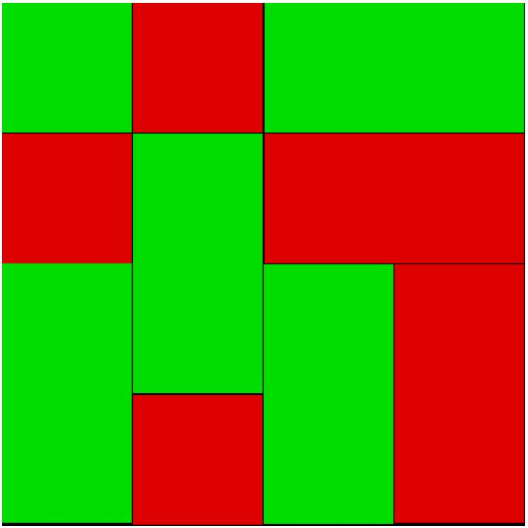

### Hard

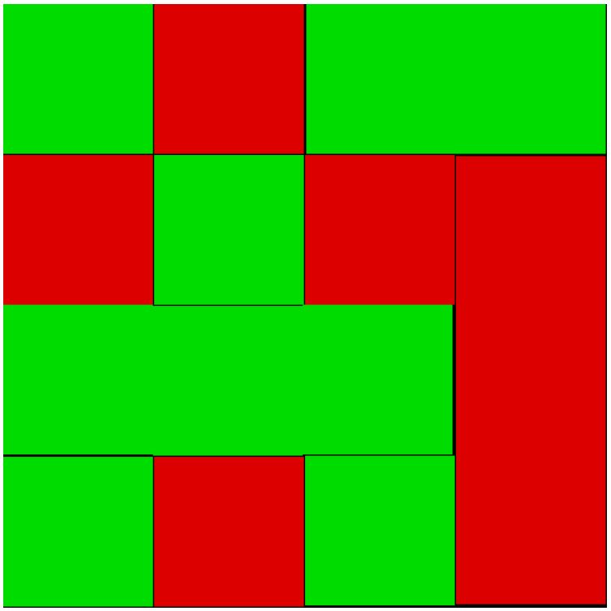